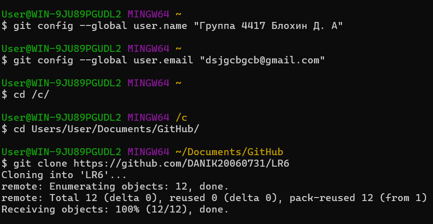
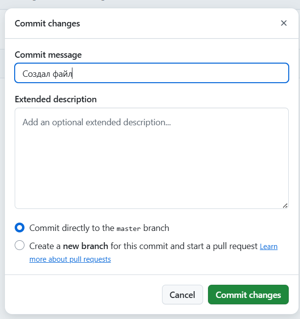
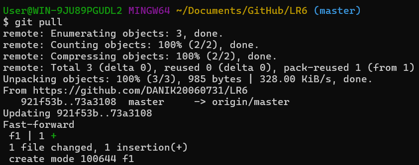
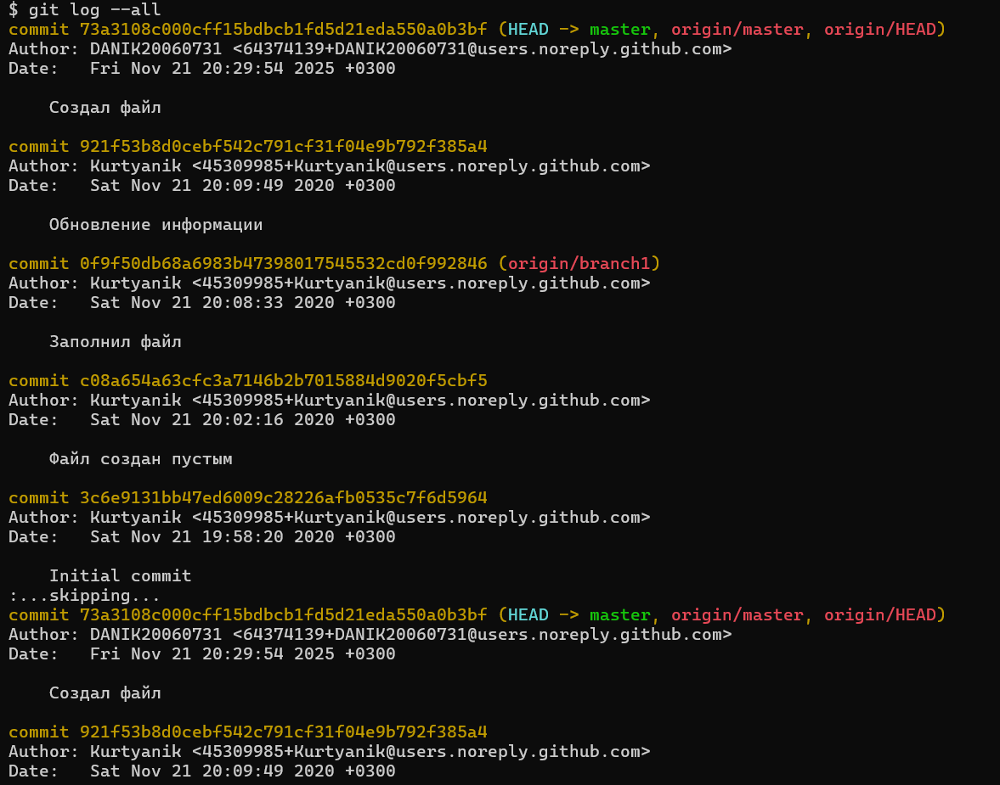
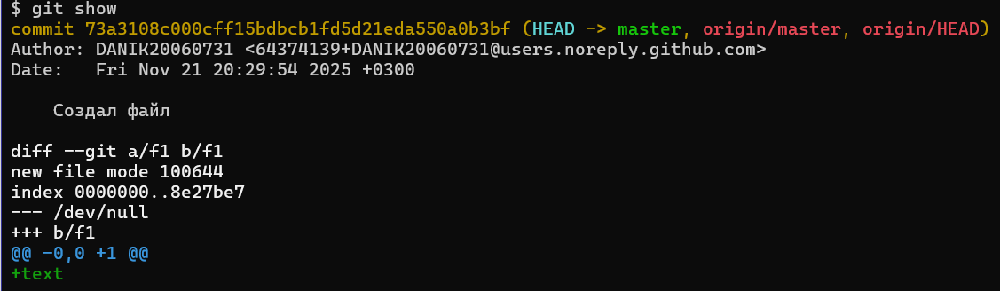
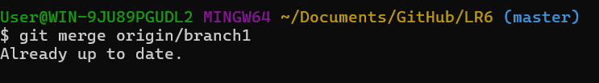
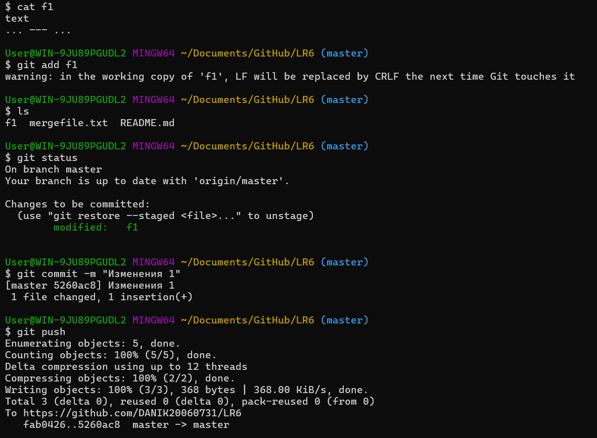
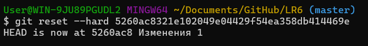
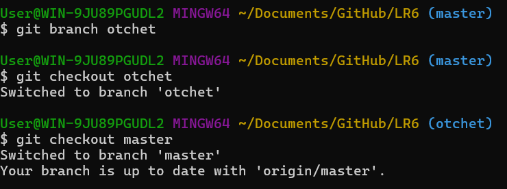
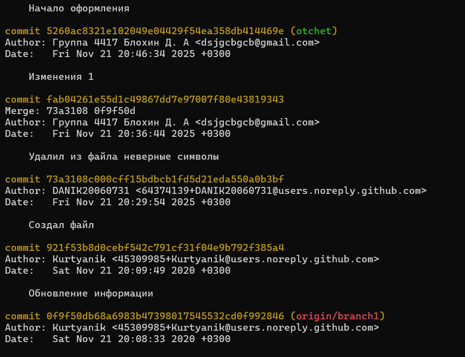

# LR6
Лабораторная работа №6
# Лабораторная работа №6

---

## Система контроля версий

---

### Цель лабораторной работы: изучение базовых возможностей системы управления версиями, опыт работы с Git Api, опыт работы с локальным и удаленным репозиторием.

---

### Ход работы

#### 1. Настроил клиент Git.

#### 2. Создал файл на сайте.

#### 3. Обновил изменения в репозитории.

#### 3. Получил историю обеих веток.

#### 4. Просмотр последниз изменений.

#### 5. Слияние веток (конфликт был устранён посредством удаления ошибочных символов из файла вручную) и удаление побочной. 

#### 6. Добавил изменений.

#### 7. Сделал откат коммита.

#### 8. Создал ветку для отчёта.

#### 9. История операций.

### Вывод

#### Изучил базовые возможности системы управления версиями, опыт работы с Git Api, опыт работы с локальным и удаленным репозиторием.